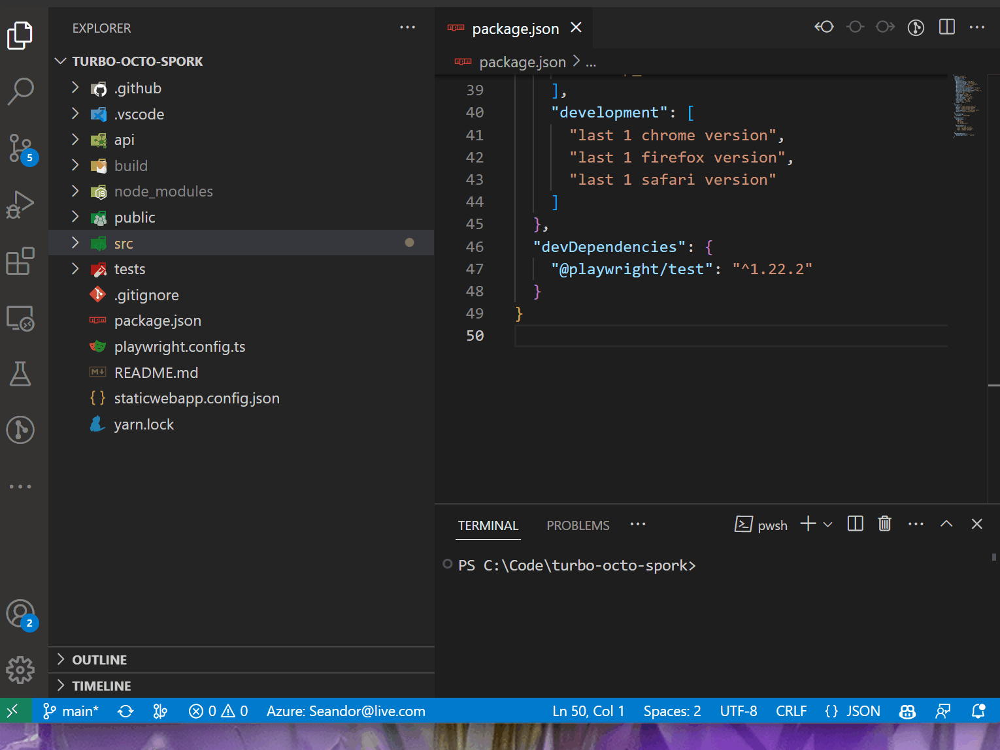

# peerdependenciesfinder README

This extension, "peerdependenciesfinder", helps you find all dependencies under a specified folder and automatically updates the package.json file. To use this extension, simply right-click on the desired folder and select the extension from the context menu.

## Features

This extension is helpful for developing packages intended for other users, enabling quick calculation of accurate peer dependencies for your package.

## Requirements

Requires VSCODE version v1.76.2 or higher.

## Extension Settings

None.

## Known Issues

- None

## Release Notes

### 0.0.6

Initial release of peer dependencies finder.

### 1.0.0

Fix duplicate dependencies if the imports are from a specific path.

### 1.0.2

Add an empty space in file ending to avoid lint errors.

---

**Enjoy!**
